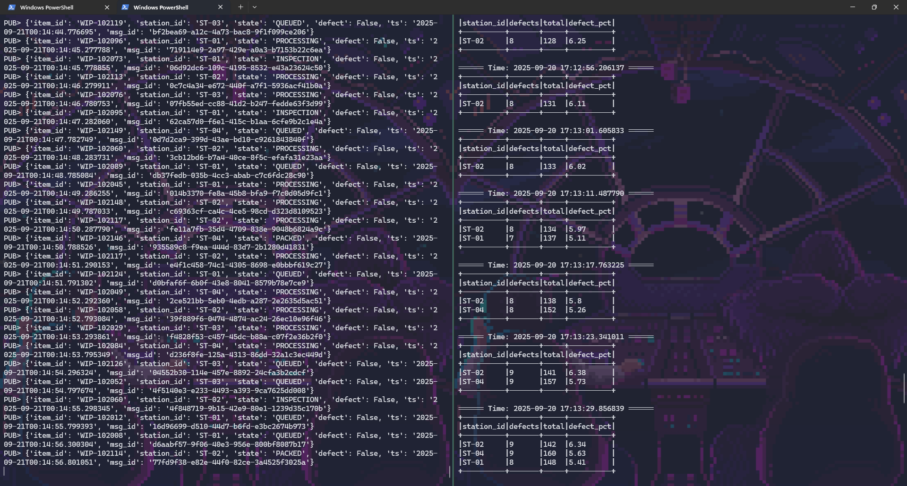

# Bài tập thực hành: Xử lý Streaming IoT với MQTT – Kafka – Spark

## Yêu cầu:
Phát hiện trạm sản xuất có tỷ lệ sản phẩm lỗi ≥ 5% theo thời gian thực bằng MQTT, Kafka và Spark Structured Streaming

## Các bước thực hiện

1. Lần lượt hoàn thành các file code theo thứ tự
- generator.py
- producer.py
- defect_detection.py

2. Khởi động cụm Docker Compose

```
docker-compose up --build -d
```

3. Tạo topic `sensors-telemetry` trong Kafka

```
docker exec -it kafka kafka-topics.sh --bootstrap-server kafka:9092 --create --topic sensors-telemetry --partitions 1 --replication-factor 1
```

4. Chạy Spark Job

```
docker exec -it spark-master spark-submit --packages org.apache.spark:spark-sql-kafka-0-10_2.12:3.5.1 ./scripts/defect_detection.py
```

5. Kết quả mong đợi

